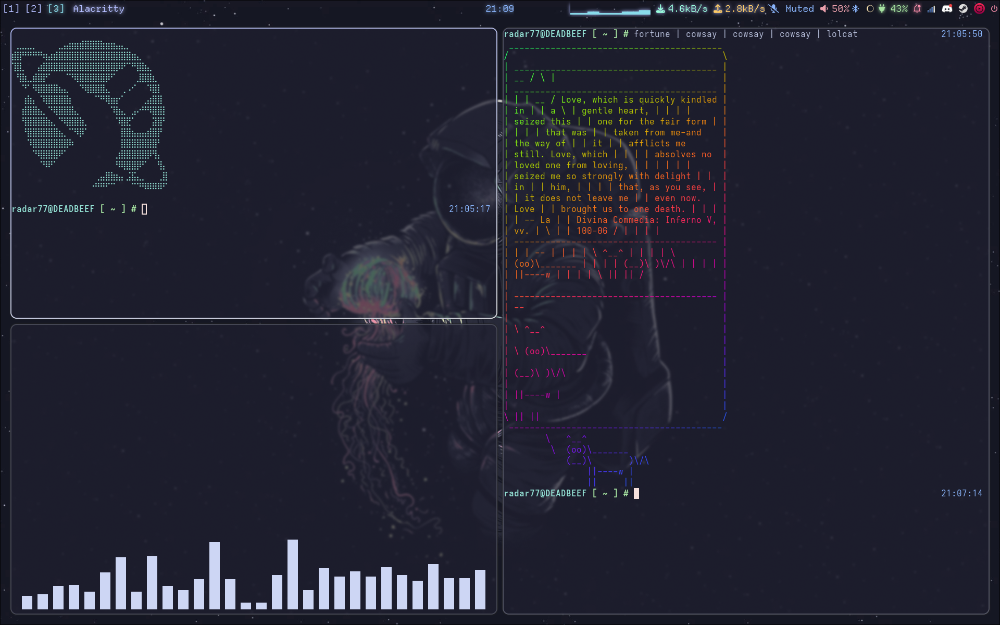
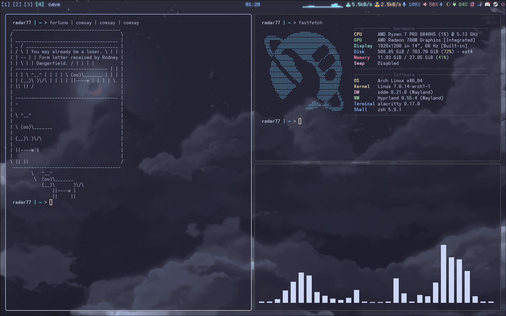

# Ch0p's dots
Dotfiles, configs, etc.

## INSTALLATION
- Copy everything in config into ~/.config
- Copy .zshrc into ~ 

## CONTAINS CONFIGS FOR
- neovim
- fastfetch
- alacritty
- cava
- hyprland
- hyprlock
- hyprpaper
- gtk 3.0 and 4.0
- ranger
- rofi
- waybar

## HISTORY
| Empty | Populated |
|---|---|
| | |
| | |